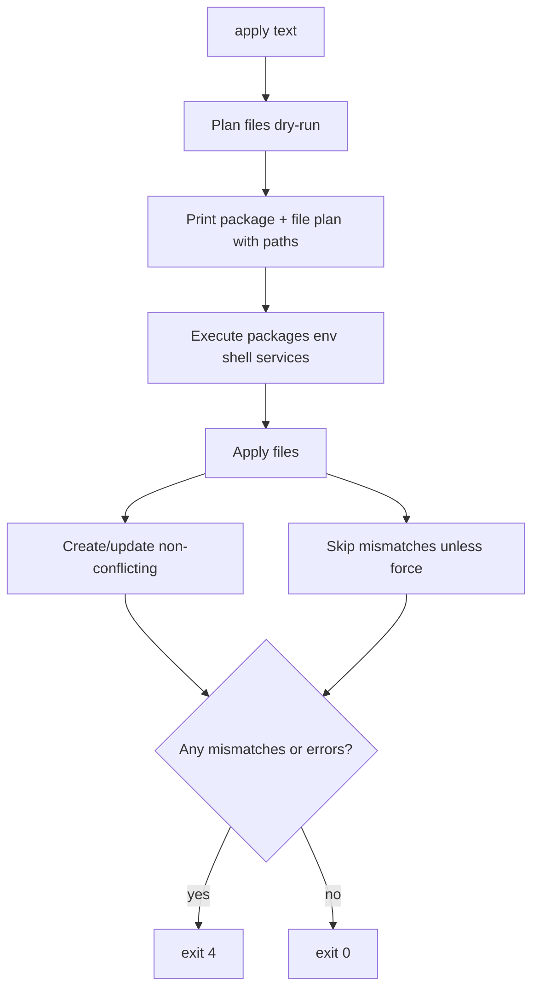

# v4.0.2 Bugfix Plan

> **For agentic workers:** Use subagent-driven development task-by-task with TDD. Persist this plan under [`docs/superpowers/plans/2026-07-26-v4.0.2-bugfix.md`](docs/superpowers/plans/2026-07-26-v4.0.2-bugfix.md).

**Goal:** Fix the open post-4.0.1 bugs so a stray file mismatch cannot block packages/services, operators can see file plans/paths without `--json`, brew-formula services and updates help work, and upgrades re-register the updates agent.

**Architecture:** Keep `files.Apply`’s existing per-entry semantics (apply non-conflicting; collect mismatches). Change only the **text apply orchestration** that currently treats a dry-run file plan error as fatal before packages. Add text printers mirroring `status --files` / JSON `data.files`. Small CLI fixes for brew status and updates help; cask + status prompts for codesigning; sandbox Darwin service tests.

**Tech Stack:** Go 1.24, existing `internal/files`, `internal/service`, launchd/Homebrew cask in `.goreleaser.yml`, table-driven + e2e integration tests.

**Defaults chosen (from report + code):**
- On mismatch without `--force`: continue packages/env/shell/services; apply non-conflicting file ops; skip mismatched entries; print each path; exit `4` if any file issues remain.
- Ownership of existing files: `genv apply --force` (+ per-entry `backup: true`); add global `apply --backup`; improve mismatch guidance. No new adopt semantics beyond clarifying/force path.
- Dual launchd wrapper redesign and migrate “fat target” note: light docs/migrate message only; no architecture change this release.

## Global Constraints

- Preserve e2e S3 contract: mismatch without force leaves the real file untouched and returns exit `4` (but packages may still run when present).
- Preserve S4: `--force` + `backup: true` creates `*.backup.*` and installs the link.
- Do not touch schema version (stay on v8).
- Review before push; tag `v4.0.2` only after CI green.

---

## Workstreams

| ID | Stream | Mode |
|----|--------|------|
| W1 | Apply file abort + text plan/paths + `--backup` | serial (touches `runApplyText`) |
| W2 | `service status` brew-formula | parallel-safe with W1 |
| W3 | `updates --help` | parallel-safe |
| W4 | Updates launchd re-register after upgrade | parallel-safe |
| W5 | Sandbox `TestApplyServices*` leakage | parallel-safe |
| W6 | Docs (repo README/CHANGELOG + note for user `~/.config/genv/docs`) | after W1–W5 |
| W7 | CHANGELOG + tag v4.0.2 | after Review/CI |

---

## Task 1 — Stop aborting apply on file plan mismatches

**Files:** [`main.go`](main.go) (`runApplyText` ~1278–1288), tests in `main_*_test.go` or new `main_apply_files_test.go`

- [ ] Write failing test: v8/v6 spec with one package + one mismatched link (no `--force`); assert package install/plan still runs and exit is `4` with path named.
- [ ] Remove early `return exitLogic` when `filePlanErr != nil` after dry-run `applyFiles` in `runApplyText`; keep `filePlan` for printing.
- [ ] After real `applyFiles`, if mismatches remain, exit `4` (packages already applied).
- [ ] Keep JSON behavior coherent (already plans both; ensure real apply still runs packages before files).

## Task 2 — Human-readable file plan + named mismatches

**Files:** [`main.go`](main.go) (near `writeFileStatus` ~1729), [`internal/files/applier.go`](internal/files/applier.go) optional

- [ ] Add `writeFilePlan(w, *files.ApplyResult)` printing lines like `create|update|mismatch|ok` + target path (reuse status wording).
- [ ] Call it from text dry-run and real apply plan sections; replace count-only `"files: N …"` as the sole signal.
- [ ] On mismatch, print paths from `filePlan.Mismatched` (do not rely on `summarize()`’s count-only string alone). Hint: `genv apply --force` (and `backup: true` / `--backup`).
- [ ] Unit test asserts dry-run stdout contains the mismatched path.

## Task 3 — `apply --backup` flag

**Files:** [`main.go`](main.go) apply options / `applyFiles`

- [ ] Add `--backup` bool; pass into `files.ApplyOptions.Backup` (today hardcoded `false` at ~1779).
- [ ] Completions + help text.
- [ ] Test: `--force --backup` backs up without needing per-entry `backup: true`.

## Task 4 — `service status` for `--brew-formula`

**Files:** [`main.go`](main.go) `serviceStatusCmd`, [`internal/service/brew.go`](internal/service/brew.go)

- [ ] Failing test with fake `brew` on PATH.
- [ ] If `svc.BrewFormula != ""`, use `BrewServicesRunning` (or thin `BrewServicesInfo`); print running/not; exit 0/4.
- [ ] Do not require `Status` argv for brew-formula services.

## Task 5 — `genv updates --help`

**Files:** [`main_updates.go`](main_updates.go), [`main_test.go`](main_test.go)

- [ ] Accept `help` / `--help` / `-h` → `printUpdatesUsage()`, return `exitOK`.
- [ ] Extend usage test; ensure no `"unknown subcommand"`.

## Task 6 — Re-register updates agent after binary replace

**Files:** [`.goreleaser.yml`](.goreleaser.yml) brew cask `post_install`, [`main_updates_daemon.go`](main_updates_daemon.go), optionally upgrade success path

- [ ] Cask `post_install`: if `~/Library/LaunchAgents/genv.updates.plist` exists, run `"#{staged_path}/genv" updates start` (reload after codesign change). Keep existing quarantine xattr strip.
- [ ] `updates status`: if `LastRunDetail` matches `(?i)codesign|OS_REASON_CODESIGNING`, print actionable `genv updates start` guidance.
- [ ] After successful `genv upgrade` when any upgraded package id is `genv` (or executable path in plist ≠ current), call re-start or print the same guidance.
- [ ] Unit test for status guidance string (inject detail); document in CHANGELOG.

## Task 7 — Stop launchd test leakage

**Files:** [`internal/service/service_test.go`](internal/service/service_test.go)

- [ ] Sandbox `TestApplyServices` / `TestApplyServicesModified` / related: `t.Setenv("HOME", temp)` + fake `launchctl` (pattern from `coverage_extra_test.go`), or skip when live launchd and rely on sandboxed twin.
- [ ] `t.Cleanup` unload/remove if any test must touch real domain (prefer never).
- [ ] Confirm no write to real `~/Library/LaunchAgents/genv.new-svc.plist`.

## Task 8 — Docs + migrate note + release prep

- [ ] CHANGELOG `v4.0.2` section; RELEASING table row.
- [ ] README apply flags: `--force`, `--backup`, file plan text behavior.
- [ ] `genv migrate` stderr/stdout one-liner when synthesizing a large target from unscoped packages (address design surprise lightly).
- [ ] Note for user: update `~/.config/genv/docs/genv/links.md` / `services.md` after ship (those live outside the repo).

## Task 9 — Verification / ship

- [ ] `go test ./...`; focused e2e `TestFiles_S3` / `S4` / `S6`; `make integration-v8` if Docker available.
- [ ] Review + CI green on PR/main.
- [ ] Tag `v4.0.2` per RELEASING.md.

## Out of scope (explicit)

- Redesigning dual `genv.*` + real launchd agents for brew/wrapper services.
- Changing migrate heuristics for package bucketing (message only).
- New schema fields for adoption.
