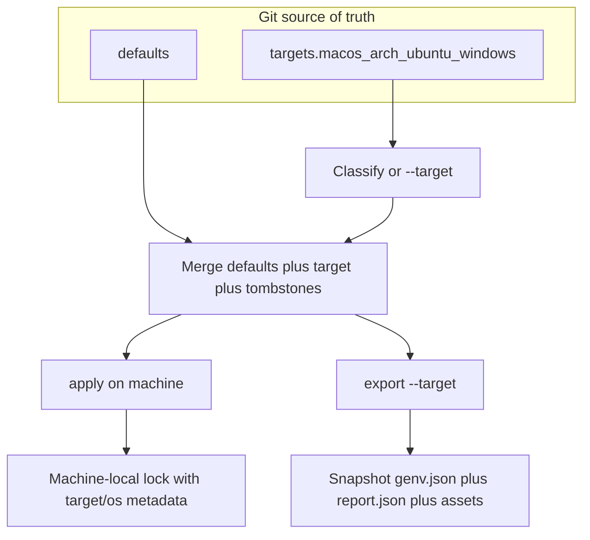

# Portable Targets + Export Design

Date: 2026-07-25  
Status: Proposed

## 1. Goal

Make a single git-tracked `genv.json` portable across machines and OSes without shipping lock files, without cross-OS uninstall disasters, and without requiring every portable setting to be duplicated per OS.

Desired outcome:

1. One multi-target source of truth in git (`defaults` + `targets.*`).
2. `genv apply` selects exactly one active target on the machine, merges defaults, then reconciles.
3. `genv export --target <id>` materializes a flat single-target snapshot plus a translation/assist report for migrating or bootstrapping another host.
4. Machine-local locks and secrets never travel with the spec or export bundles.

### Problem (today)

- Host classification only recognizes `macos` / native `windows` / `wsl2` / `arch`. Other Linux distros get an empty host unless `GENV_HOST` / `--host` is set, so host-scoped packages are skipped silently.
- WSL2 blindly inherits Arch `host` predicates (`Match` treats `wsl2` as matching `"arch"`), which is wrong for Ubuntu WSL and conflates native Arch with WSL-Arch.
- Env, shell, and similar top-level maps are not host-filtered; a shared spec can apply macOS or Windows shell fragments on Linux.
- Lock files are machine-local in intent but not gated: applying a foreign macOS lock on Arch can plan `mas` / `brew` uninstalls and produce false “up to date” results.
- There is no first-class export/bootstrap path that produces a target-specific snapshot and a human-readable mapping report.
- Per-record `host` predicates scatter OS policy across every package/file/hook and do not scale for multi-machine portability.

### Decisions

| Topic | Choice |
|-------|--------|
| Architecture | Approach 1: multi-target git source of truth; apply selects active target; `export --target` materializes flat snapshot + report |
| Schema shape | Everything under `targets.<name>` (packages, env, shell, files, services, hooks); optional top-level `defaults`; no per-record `host` in v8 |
| Defaults merge | Optional shared portable env/shell (and similar); merged into every target; target wins; tombstones drop a default on one OS; no *required* shared base |
| Translation | Assist-only (`export` report / `genv map`); no silent auto-write; no runtime magic resolve of foreign managers |
| Linux packaging | Snap in scope for Ubuntu and other snap-capable hosts; apt/dnf deferred; Arch-first + snap + linuxbrew remain the supported Linux channels |
| Locks / secrets | Machine-local; never included in export bundles or pull artifacts |
| Schema version | Clean break **v8**; v1–v7 still load for `migrate` / `export --from-v7` |
| Debloat / benchmarks | Explicitly out of scope for this design and its follow-on implementation plan; separate later design after the portability suite ships |

### Architecture



Apply and export share the same select → merge pipeline. Only the sink differs: apply writes the live system + lock; export writes a directory bundle.

## 2. Schema (v8)

### Top-level shape

```json
{
  "schemaVersion": "8",
  "repo": { "url": "...", "ref": "main" },
  "defaults": {
    "env": { "EDITOR": "nvim" },
    "shell": {
      "aliases": {
        "ll": { "value": "ls -la" }
      }
    }
  },
  "targets": {
    "macos": {
      "packages": [{ "id": "git", "prefer": "brew" }],
      "env": { "HOMEBREW_NO_ANALYTICS": "1" },
      "shell": { "aliases": { "brewup": { "value": "brew update && brew upgrade" } } },
      "files": {},
      "services": {},
      "hooks": {}
    },
    "arch": { "packages": [{ "id": "git", "prefer": "pacman" }] },
    "ubuntu": { "packages": [{ "id": "git", "prefer": "snap" }] },
    "windows": { "packages": [{ "id": "git", "prefer": "winget" }] },
    "wsl-arch": { "packages": [{ "id": "git", "prefer": "pacman" }] }
  }
}
```

Rules:

- `schemaVersion` must be `"8"` for new multi-target specs.
- Top-level `packages`, `env`, `shell`, `files`, `services`, and `hooks` are **illegal** in v8 (validation error). Those fields exist only inside `defaults` and/or `targets.<name>`.
- Per-record `host` predicates are **illegal** in v8. OS selection is entirely by target bucket.
- `defaults` is optional. Omitting it is valid; there is no required shared base.
- `targets` must be a non-empty object whose keys are known or explicitly allowed target IDs (see below). At least one target is required.
- `repo` remains top-level (shared metadata, not target-scoped).
- Secrets stay out of the git spec and out of export bundles (unchanged product rule; reinforce in docs and bundle writer).

### Canonical target IDs

| Target ID | Meaning |
|-----------|---------|
| `macos` | Native macOS |
| `windows` | Native Windows (not WSL) |
| `arch` | Native Arch Linux (and Arch derivatives via `ID` / `ID_LIKE`) |
| `ubuntu` | Ubuntu and Ubuntu-like hosts where snap/linuxbrew are the intended channels |
| `wsl-arch` | WSL2 running Arch (or Arch-like) |
| `linux` | Optional catch-all Linux target when a finer ID is unavailable or intentionally unused |

`Classify()` (and `--target` / `GENV_TARGET`) resolve to one of these IDs. The legacy class `wsl2` is retired for matching: WSL hosts classify as `wsl-arch` when Arch-like, otherwise as `ubuntu` when Ubuntu-like, else require an explicit override (`GENV_TARGET` / `--target`) or fail closed.

Blanket WSL2→arch inheritance in `host.Match` is **removed**. A record or bucket for `arch` never silently applies on WSL Ubuntu.

### Defaults merge and tombstones

Merge produces an effective single-target document for apply/export:

1. Start from a deep copy of `defaults` (or empty if omitted).
2. Overlay the selected `targets.<active>` field-by-field.
3. Target wins on key collision for maps (`env`, alias names, function names, service names).
4. Arrays (`packages`, hook lists, file link lists) are **replaced** by the target when the target defines that field; they are not concatenated. If the target omits the field, defaults keep it.
5. Tombstones drop a default key on one OS without forking the whole defaults block:
   - Env: `"VAR": null` in the target clears that default env key for this target.
   - Shell aliases / functions: `"name": null` clears that default entry for this target.
   - Tombstones never invent a key that was not present in defaults; they only suppress.

After merge, the effective document looks like a flat v7-style payload (packages/env/shell/…) with no `defaults`/`targets` wrapper—suitable for the existing apply pipeline after adapters are pointed at the merged view.

### Migration from v7

- `genv migrate` (or `export --from-v7`) reads v1–v7 specs that still use top-level fields and per-record `host`.
- Migration buckets each record into `targets.<id>` by its `host` predicate:
  - Empty `host` → copy into **every** generated target bucket (or into `defaults` when the migrator can prove the record is portable env/shell-only—prefer `defaults` for env/shell with empty host; packages/files/services/hooks with empty host go to all concrete targets present in the fixture or to a generated `linux`/`macos`/`windows` set derived from observed predicates).
  - `host: ["macos"]` → `targets.macos` only.
  - `host: ["arch"]` or `["arch","wsl2"]` → `targets.arch` and, when `wsl2` appears, `targets.wsl-arch` (do not treat `arch` alone as implying WSL).
  - `host: ["wsl2"]` alone → `targets.wsl-arch` by default, with a migration warning that Ubuntu WSL users must rebucket to `ubuntu`.
- Output is schemaVersion `"8"` with illegal top-level fields removed and all `host` keys stripped.
- v1–v7 remain readable for migrate/export-from-v7 only; new writes from genv commands that mutate the spec produce v8 when the project has migrated.

## 3. Apply, classification, and locks

### Active target selection

Resolution order for the active target ID:

1. `--target <id>` (CLI)
2. `GENV_TARGET`
3. `Classify()` from the live OS / distro / WSL signals
4. Failure: if still unresolved, exit nonzero with guidance to set `--target` or `GENV_TARGET`

After resolution:

- If `targets.<active>` is missing → **fail**. Do not fall back to another target. Do not apply `defaults` alone as if it were a full machine profile.
- `--host` / `GENV_HOST` remain for hostname-style overrides where still needed (hooks env, legacy tests), but **target selection is not hostname matching**. Docs steer users to `--target` / `GENV_TARGET` for portability.

### Apply pipeline

1. Read + validate v8 spec.
2. Select active target (above).
3. Merge defaults + target + tombstones → effective document.
4. Foreign-lock gate (below).
5. Existing reconcile / execute apply against the effective document (packages, env, shell, files, services, hooks).
6. On success, write/update the machine-local lock **including target and OS metadata**.

### Foreign-lock gate

Before reconcile, compare the existing lock (if any) to the current machine:

Refuse reconcile (nonzero) when any of:

- Lock records a `target` (or equivalent metadata) that does not match the active target.
- Lock records an OS / GOOS (or classified OS) that does not match this host.
- Lock contains package entries whose managers are unavailable on this host **and** those entries would drive uninstall or “already managed” decisions that are unsafe across OS boundaries (concrete rule: if any lock package manager is not in the detected available-manager set for this host, treat the lock as foreign unless the user passes an explicit override).

User-visible guidance on refusal:

- Explain the mismatch (lock target/OS vs current).
- Suggest backing up the lock file.
- Suggest `--force-new-lock` or deleting the lock and running a fresh apply so the machine gets a new lock for the active target.

`--force-new-lock` semantics:

- Back up or discard the foreign lock per implementation detail (prefer rename backup beside the lock path).
- Proceed with apply using an empty prior lock for uninstall planning (install-only / adopt from effective spec; do not uninstall foreign-manager packages that are not present as local adapters).

MacOS lock on Arch must never plan `mas` or `brew` uninstalls.

### Snap / Linux channels

- Ubuntu (and other snap-capable targets) may prefer `snap` and/or `linuxbrew` in target package entries.
- `apt` / `dnf` / `apk` adapters remain deferred; absence is documented, not papered over with silent host skips.
- Arch targets continue to use `pacman` / `paru` / `yay` as today.
- Cross-target package identity is not auto-translated at apply time (see §4 assist-only translation).

## 4. Export, map, bootstrap, and pull

### `genv export --target <id>`

Materializes a directory (default or `--out`) containing:

| Artifact | Contents |
|----------|----------|
| `genv.json` | Flat v8 snapshot for the selected target only: `schemaVersion: "8"`, optional empty/omitted `defaults`, and a single `targets.<id>` bucket containing the merged effective packages/env/shell/files/services/hooks. Sibling targets are omitted. Apply-valid on a machine whose active target is that id. |
| `report.json` | Structured assist report (see below) |
| `report.md` | Human-readable summary of the same findings |
| Copied assets | Relative `files` / template sources referenced by the snapshot, rewritten to bundle-relative paths where needed |

Never included:

- `genv.lock.json` / any lock
- Secrets stores / credential files
- Absolute machine-local cache paths

Flags:

- `--target <id>` (required unless only one target exists and can be inferred—prefer required for clarity)
- `--out <dir>`
- `--strict` → exit nonzero if the report contains any error-class items
- `--from-v7` → accept a v7 input path, migrate in-memory, then export (optional convenience)

### Report classes (assist-only)

Translation is **assist-only**. Export and `genv map` never mutate the source spec without an explicit user confirm/apply step.

Error-class examples (fail `--strict`):

- Package has no manager mapping usable on the export target (e.g. `prefer: mas` when exporting to `arch` / `ubuntu` with no alternate `managers` entry)
- Absolute paths or untyped path entries that cannot be relocated into the bundle
- Target ID unknown / missing bucket

Warning-class examples (nonzero only with a future `--warnings-as-errors` if added; default: warn, exit 0 unless `--strict` hit an error-class):

- Package present only via a deferred channel (apt/dnf suggestion text)
- Env vars that look machine-specific (`PATH` fragments with Homebrew prefixes, etc.)
- Shell aliases that embed OS-specific commands

Suggestion-class examples:

- “On ubuntu, consider `snap` or `linuxbrew` for `ripgrep`”
- “No `targets.ubuntu` bucket; create one before applying on Ubuntu”

### `genv map`

Read-only (by default) assistant that prints suggested manager/target mappings for packages lacking a usable entry on a destination target. Writing suggestions into the spec requires an explicit confirm flag (e.g. `--apply-suggestions`) and never runs implicitly during `apply` or `export`.

### Bootstrap / pull bundle

- `genv pull` must copy the spec **and** relative source assets declared by `files` (fix SourceRoot / bundle copy so pull is usable as a multi-machine bootstrap, not only a single JSON overwrite).
- Pull still must **not** fetch or overwrite the machine-local lock or secrets.
- After pull on a new machine: classify/select target → foreign-lock gate (empty lock OK) → apply.

### Non-goals for this design

- Silent auto-rewrite of the git source during apply
- Runtime magic that installs `brew` packages on Arch because a macOS target mentioned them
- Shipping apt/dnf/apk adapters in this design
- Including locks or secrets in export/pull artifacts
- Codebase debloat, cold-start optimization, or benchmark redesign (later, separate design after this suite)

## 5. Errors, testing, and rollout

### Errors (user-visible, nonzero where appropriate)

| Condition | Behavior |
|-----------|----------|
| No matching `targets.<active>` | Fail apply/export; do not apply another target; do not use defaults alone as a full profile |
| Unresolved classification (unknown distro, ambiguous WSL) | Fail with guidance to set `--target` / `GENV_TARGET` |
| Foreign lock (target/OS mismatch or lock managers unavailable here) | Refuse reconcile; suggest backup + `--force-new-lock` / fresh apply |
| `export --strict` with error-class report items | Nonzero exit; write report artifacts unless `--out` write itself failed |
| Map assist without confirm | Never mutates spec; suggestions to stdout/report only |
| v8 spec with top-level packages/env/shell/files/services/hooks or per-record `host` | Validation failure |
| Tombstone for unknown default key | Validation warning or error (prefer error for typos) |

### Testing (bulletproofing bar)

**Unit**

- Defaults merge + tombstone matrix (env, aliases, omitted vs empty vs null).
- `Classify` → target ID: `macos`, `windows`, native `arch`, `ubuntu`, `wsl-arch` vs Ubuntu WSL (no blanket arch inherit).
- Foreign-lock matrix: macOS lock on Arch must not plan `mas`/`brew` uninstall; matching target+OS lock still reconciles normally; `--force-new-lock` path starts clean.
- Schema validate: reject top-level fields and `host` on v8; accept `defaults` + `targets`.

**Export golden**

- Fixture multi-target repo → snapshot `genv.json` + `report.json` (+ md) for at least `macos` and `ubuntu`/`arch`.
- Strict mode exit codes covered.

**Container / integration regressions** (reuse W7/W8 harness ideas from the v4 readiness audit)

- Arch container + foreign macOS lock → refuse; after force-new-lock / fresh apply → no foreign uninstall plan.
- Ubuntu + snap path: fixtures/docs prove snap-oriented target packages resolve when snap is available; document behavior when snap is absent.

**Migrate**

- v7 `host`-scoped fixture → v8 targets buckets; empty-host env/shell land in `defaults` when portable; arch/wsl2 predicates map as specified in §2.

### Rollout

1. Land this design (this document).
2. Write an implementation plan via writing-plans (portability + related audit fixes sequenced; **debloat explicitly out**).
3. Implement schema v8 + classify + merge + foreign-lock gate + export/map + pull asset copy with the test bar above.
4. Docs in the same implementation train:
   - Multi-machine / portable targets guide
   - WSL guide update (no blanket Arch inheritance; `wsl-arch` vs `ubuntu`)
   - README target table and supported Linux channel notes (Arch-first + snap + linuxbrew; apt/dnf deferred)
   - CHANGELOG entry for v8 / portability
5. Optimization / debloat design only after that suite ships.

### Compatibility summary

| Version | Role after this work |
|---------|----------------------|
| v1–v7 | Still load for `migrate` / `export --from-v7`; per-record `host` still understood by migrator |
| v8 | Only supported shape for new multi-target source of truth; apply requires a matching target bucket |

### Key files (implementation plan input; not part of this design commit)

- `internal/host/` — Classify target IDs; remove wsl2→arch blanket inherit; WSL distro discrimination
- `internal/schema/` — Version8, `defaults`, `targets`, validation, tombstone types
- `main.go` / apply path — select target, merge, foreign-lock gate, `--target` / `--force-new-lock`
- `internal/genvfile/lockfile.go` — target / OS metadata on lock
- New: export + map + bootstrap helpers; fix `main_pull.go` SourceRoot / bundle asset copy
- Docs: multi-machine guide, WSL guide, README target table, CHANGELOG
)
