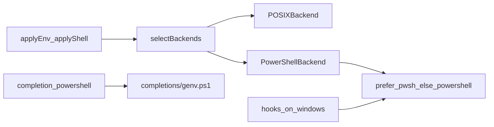

# PowerShell Integration Design

Date: 2026-07-25  
Status: Approved

## Goal

Give native Windows hosts first-class PowerShell parity for managed env/shell fragments, profile injection, completions, and hook execution—without requiring PowerShell on non-Windows hosts.

## Decisions

| Topic | Choice |
|-------|--------|
| Scope | Env + shell parity, PowerShell completions, PowerShell-backed hooks (Scope C) |
| Engine | Prefer `pwsh`, fall back to `powershell.exe` (Engine D) |
| Schema | Extend `shell` target with `"powershell"`; omitted `shell` = POSIX-only; shared `env` map (Schema A) |
| Architecture | Profile-backend abstraction: `POSIXBackend` + `PowerShellBackend` (Approach B) |
| Schema version | Additive **v7** |

## Architecture

### ProfileBackend

Shared apply/status owns lock updates and drift-vs-lock. Backends only:

- Resolve fragment paths (`env.sh` / `shell.sh` or `env.ps1` / `shell.ps1` under the genv config dir)
- Render fragment content
- Inject/remove a source line in the appropriate profile/rc

### Backend selection

- **Non-Windows:** POSIX only. No PowerShell fragment or profile writes. Spec entries with `shell: "powershell"` are stored but inert.
- **Windows + engine present:** Always run PowerShellBackend. Also run POSIXBackend only if a POSIX shell/rc is already relevant (`$SHELL` is bash/zsh/fish, or `~/.bashrc` / `~/.zshrc` exists).
- **Windows + no engine:** Warn and skip PowerShell paths; do not fail the whole apply solely for that.

### Engine detection

`DetectPowerShellEngine()` looks up `pwsh` then `powershell` / `powershell.exe` on `PATH`. Hooks and apply share this preference order.

## Schema (v7)

- Allow `"shell": "powershell"` on aliases and functions.
- Omitted `shell` remains POSIX-only (never auto-emitted into PowerShell fragments).
- Shared `env` map: POSIX backend emits `export NAME=...`; PowerShell backend emits `$env:NAME = '...'`.
- `shell.source` entries: emitted by POSIX backend for all sources; PowerShell backend emits `. 'path'` for the same list when applying on Windows (sources are path-oriented and useful in both worlds). PowerShell-only source scoping is deferred.

## Rendering

- Env: PowerShell single-quote escaping (`'` → `''`).
- Aliases with `shell: "powershell"`: emit as `function Name { <value> }` so argument-bearing aliases work.
- Functions with `shell: "powershell"`: emit `function Name { body }` with validation that rejects newlines used to break out of the function and obvious statement separators where we already reject POSIX metacharacters—reuse a conservative allow/deny set documented in validate.
- Profile inject: CurrentUserCurrentHost profile (`$PROFILE` equivalent path). Idempotent: append a marked block that dotsources the managed fragment if not already present.

## Hooks (Windows)

Replace `cmd /C` with the detected PowerShell engine:

- Inline: `pwsh|powershell -NoProfile -Command <hook>`
- Script file: `pwsh|powershell -NoProfile -File <path>`

Non-Windows remains `sh -c` / `sh`.

## Completions

- Embed `completions/genv.ps1`.
- `genv completion powershell` prints it.
- `genv completion install powershell` writes to a PowerShell completion directory under the user’s Documents PowerShell/WindowsPowerShell modules or a documented default under the genv config dir if profile-based register is simpler—default install path: `~/.config/genv/completions/genv.ps1` plus a one-line profile register note, or PowerShell’s standard completion path when detectable.

## Errors

- Missing PS engine on Windows: warn, skip PS backend, apply continues.
- Profile inject failure: warning (match current POSIX inject non-fatal behavior) unless write of fragment itself fails (fatal).
- Hook failure/timeout: unchanged semantics.

## Testing

- Unit tests with temp HOME and fake profile paths (no live PowerShell required for render/inject).
- Engine detection with fake PATH binaries.
- Hook runner argv recording with fake `pwsh`/`powershell`.
- Schema v7 + `shell: "powershell"` validation tests.

## Non-goals

- `pwsh` apply targets on macOS/Linux
- Per-env `shell`/`host` scoping
- Publishing genv to winget/scoop/choco
- Live session drift probing
- PSGallery adapters

## Key files

- `internal/profilebackend/` (new)
- `internal/env`, `internal/shellcfg` (POSIX remains source of truth for POSIX render)
- `internal/hooks/executor.go`
- `internal/schema` (Version7, KnownShellTargets)
- `main.go` apply + completion
- `completions/genv.ps1`
- `docs/windows-install.md`, `README.md`, `CHANGELOG.md`
